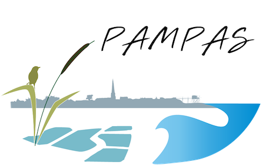
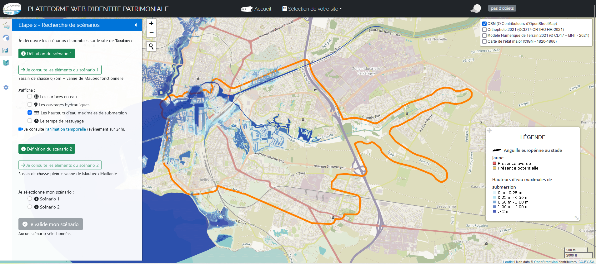
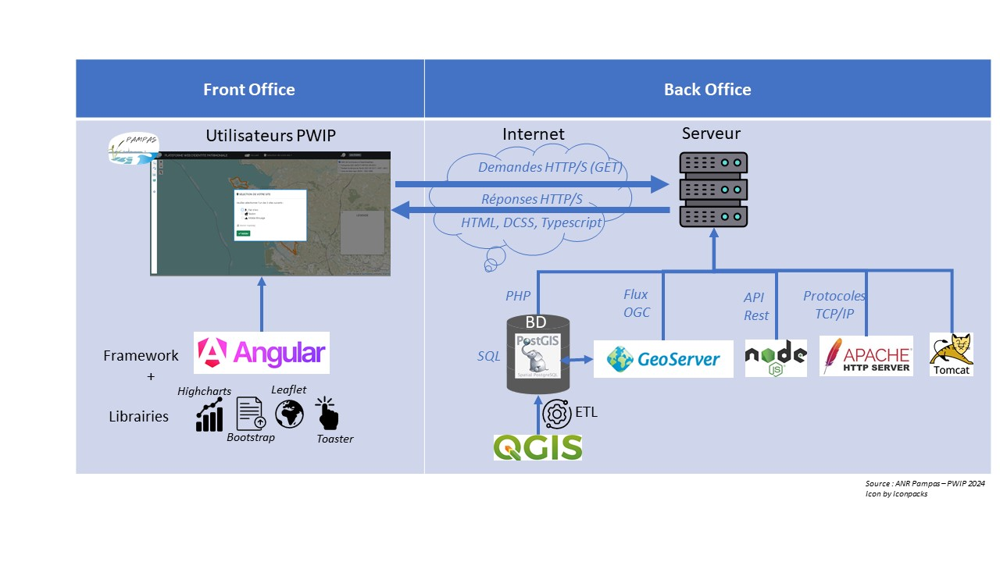

{: width="5%"} [PWIP : Plateforme Web d’Identité Patrimoniale](#) {: width="30%"}


---
## Sommaire
 - [Présentation générale](#présentation-générale)
 - [Pré-requis](#pré-requis)
 - [Architecture fonctionnelle](#architecture-fonctionnelle)
 - [Angular](#angular)
 - [Installation](#installation)
 - [Usage](#usage)
 - [Support](#support)
 - [Feuille de route](#feuille-de-route)
 - [Contribuer à PWIP](#contribuer-à-PWIP)
 - [Auteurs et remerciements](#auteurs-et-remerciements)
 - [License](#license)
 - [Statut du projet](#statut-du-projet)


# Présentation générale 
Développée dans le cadre du projet [PAMPAS](https://pampas.recherche.univ-lr.fr/), [PWIP](https://data.pampas.univ-lr.fr/pwip/) est une plateforme cartographique interactive qui vise à mieux comprendre l’évolution du patrimoine des marais charentais face à l’aléa submersion marine. Utilisée dans le cadre d’ateliers, elle est destinée aux scientifiques, élus et gestionnaires des marais littoraux, impliqués dans la gestion du patrimoine. Elle permet, à la fois de s’interroger sur ce qu’est le patrimoine dans les marais littoraux, d’en visualiser les éléments, de tester des scénarios de submersion et des modes de gestion et enfin de comprendre leur degré de sensibilité face à la submersion marine. PWIP s’inscrit comme un outil de valorisation scientifique, couplé à un volet pédagogique par son utilisation dans le cadre d’ateliers.

PWIP a été développée par deux partenaires du projet : le laboratoire [LIENSs](https://lienss.univ-larochelle.fr/) et le [Forum des Marais Atlantiques](https://forum-zones-humides.org/). 


## Pré-requis

PWIP est déployée sur un serveur Linux (Ubuntu - 18.04 Bionic).
Elle repose sur différentes technologies et briques logicielles, pour stocker, requêter, visualiser et diffuser les résultats du projet comprenant : 
- un serveur application Tomcat (8.5.20)
- un serveur cartographique Geoserver (2.15.1)
- un serveur web Apache HTTPD (2.4.29)
- une base de données PostGreSQL/PostGIS (10.23 / 2.4)
- une architecture reposant sur le Framework Web opensource Angular (13.3.1) complétée par :
    - un Back Office JS : Node JS (16.10) pour pouvoir déployer les webservices côté serveur
    - le langage PHP (7.2.24) pour l'excution des scripts en interactions avec la base de données.
    - des langages et méthodes de développement de l’application : Typescript, HTML, SCSS, API Rest, API Geoserver, SQL


Les principaux scripts d'installation pour ces pré-requis sont disponibles dans le répertoire « installation ». A noter qu’une perspective d’amélioration sera la mise en place d’une image Docker permettant un redéploiement facilité de l’infrastructure créée, sur d’autres serveurs, pour d’autres projets.


## Architecture fonctionnelle
Le schéma ci-dessous synthétise l'architecure simplifiée de l'application web cartographique PWIP 
{: width="60%"}

Le principe est le suivant :
- L’interface de visualisation sur laquelle l’utilisateur peut consulter données et fonds de plan côté client a été développée à l’aide du framework Javascript Angular. 
Ce framework Angular repose sur une architecture MVC : Modèle -Vue - Contrôleur permettant de séparer les données, le visuel et les actions pour une meilleure gestion des responsabilités.
- Cette interface communique avec la base de données PostgreSQL via des requêtes GET et POST construites à l’aide du standard de l’API REST. Les différentes API ont été déployées via la solution Node JS. Node JS peut être considéré comme un environnement permettant l'exécution de JavaScript côté serveur. 
- L’interface permet également la diffusion d’API cartographiques : les flux WMS. Ces flux ont été produits à l’aide du serveur cartographique Geoserveur, installé sur un conteneur Java Tomcat. Ces flux permettent la diffusion des données stockées en base PostgreSQL.
- L’ensemble des APIs est rendu fonctionnelle via la présence d’un serveur Apache


### Angular
A noter :
- Le contrôleur et le modèle sont représentés par l'instance de la classe TypeScript de chaque composant (fichiers ts). Le contrôleur met à jour l'état du modèle.
- La vue correspond au rendu associé à chaque composant (fichiers html). La vue déclenche des actions sur le contrôleur et est associé à un fichier de style (fichier scss)

Arborescence générale des fichiers
```bash
├── home
│   ├── admpampas
│   │   ├──scripts
│   │        ├──fillScenario.php
│   │        ├──resumeAttributs.php
│   │   ├──system
│   │       ├──plateforme
│   │           ├──node_modules
│   │           ├──src
│   │               ├──app
│   │                   ├──api
│   │                   ├──home
│   │                       ├──home.component.*
│   │                   ├──interface
│   │                       ├──interface.component.*
│   │                   ├──notification
│   │                       ├──notification.ts
│   │                   ├──app.component.*
│   │               ├──assets
│   │               ├──environments
│   │           ├──*.json          
├── var
│   ├── www
│   │   ├──html
│   │       ├──pwip
│   │           ├──assets
│   │               ├──*.css
│   │               ├──*.js
│   │           ├──appli
│   ├── run
│   ├── images
│   ├── index.html
│   ├── js
│   │   ├── **/*.js
│   └── xxx/xxxx
├── lib
```

## Installation et paramétrage
### Angular
Angular :
L’ensemble des modules complémentaires a pu être installé via le gestionnaire de paquets npm :
- NgBootstrap : https://www.npmjs.com/package/@ng-bootstrap/ng-bootstrap 
- angular-highcharts : https://www.npmjs.com/package/angular-highcharts 
- ngx-toastr : https://www.npmjs.com/package/ngx-toastr
- ngx-slider : https://www.npmjs.com/package/@angular-slider/ngx-slider
- ngx-spinner : https://www.npmjs.com/package/ngx-spinner
- ng2-search-filter : https://www.npmjs.com/package/ng2-search-filter
- ng-speed-test : https://www.npmjs.com/package/ng-speed-test 
- leaflet : https://www.npmjs.com/package/leaflet (à noter que les dépendances leaflet-sidebar, Leaflet.Dialog, leaflet.modal, leaflet-measure, leaflet-control-boxzoom, L.Control.Opacity et L.Control.Geocoder ont également été installées)

### NodeJS
L’ensemble des modules complémentaires a pu être installé via le gestionnaire de paquets npm :
- cors : https://www.npmjs.com/package/cors 
- express : https://www.npmjs.com/package/express 
- body-parser : https://www.npmjs.com/package/body-parser 
- fs : https://www.npmjs.com/package/fs 
- https : https://www.npmjs.com/package/https 
- pg : https://www.npmjs.com/package/pg 
- svg2png : https://www.npmjs.com/package/svg2png 
- docx : https://www.npmjs.com/package/docx 
- adm-zip : https://www.npmjs.com/package/adm-zip 
- pm2 : https://www.npmjs.com/package/pm2 


## Usage
Simuler le devenir du patrimoine des marais face au changement climatique en testant divers scénarios. L'objectif est de mieux comprendre le fonctionnement des zones humides côtières face à l’aléa de submersion marine, pour questionner l’évolution de leur identité patrimoniale en fonction de leur mode de gestion.
Par exemple, selon le scénario, une espèce animale aura une sensibilité plus ou moins grande à la submersion: non impacté, amélioration, adaptation ou disparition. 

## Support
Pour toutes questions : @ ?


## Feuille de route (évolutions, corrections bugs...)
Bugs :
- Bugs constatés lorsque l’enchaînement des traitements est trop rapide
- Mettre en place un module d’analyse et de supervision des performances
- Améliorer la lecture des logs, ceux-ci sont actuellement produits par le gestionnaire de processus pm2 et disponible dans des fichiers classiques de logs. Un module spécifique dans l’interface web permettrait de simplifier leur lecture.

Evolutions :
- Intégration de modèles associés à d’autres risques (salinisation par ex.) 


## Contribuer à PWIP
Nous sommes ouvets à toutes contributions.

## Auteurs et remerciements
  
PWIP a été développée par deux partenaires du projet : le [Forum des Marais Atlantiques](https://forum-zones-humides.org/) et le laboratoire [LIENSs](https://forum-zones-humides.org/).
L'équipe de développement est composée de Julien Hubert du [Forum des Marais Atlantiques], Cécilia Pignon-Mussaud du laboratoire [LIENSs](https://lienss.univ-larochelle.fr/) et Fabien Blanchet du [Forum des Marais Atlantiques](https://forum-zones-humides.org/). Elle remercie le groupe de travail qui a permis de co-construire cette plateforme et tout particulièrement l'équipe de coordination de l'ANR Pampas : Thomas Lacoue-Labarthe ([LIENSs](https://lienss.univ-larochelle.fr/)), Nathalie Long ([LIENSs](https://lienss.univ-larochelle.fr/)) et Marie Vagner ([LEMAR](https://www-iuem.univ-brest.fr/lemar/)), ainsi que Nicolas Becu et Benjamin Amann du ([LIENSs](https://lienss.univ-larochelle.fr/)).


## License
L'ensemble de la documentation et des scripts de PWIP sont en licence opensource XXXX.


## Statut du projet
Le développement de PWIP est actuellement arrêté, correspondant au livrable attendu par de l'ANR.
Néanmoins, une nouvelle version est à l'étude pour intégrer la salinité des marais dans les simulations. 
